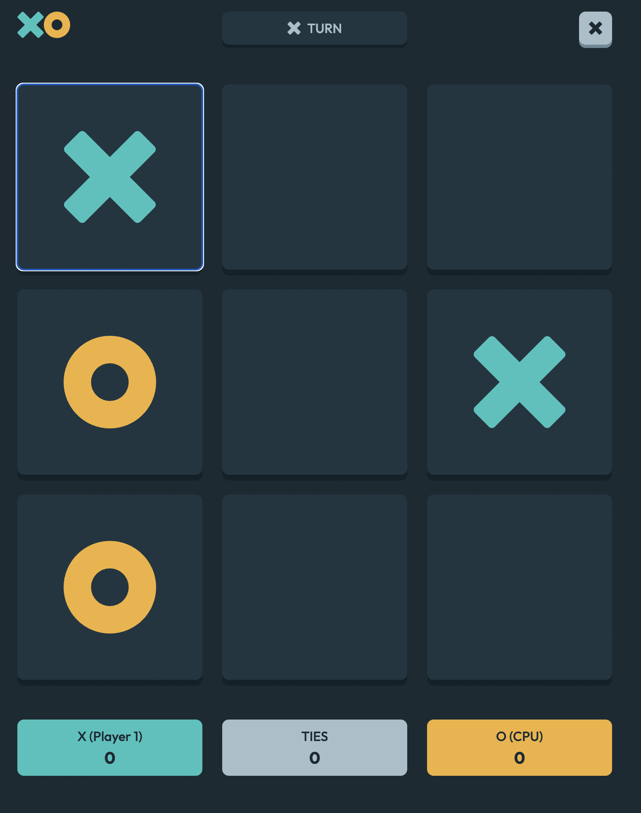

# XO | Noughts & Crosses
[
https://xo.up.railway.app/](https://xo-play.vercel.app/)

XO is a noughts and crosses webist that allows users to play against their frie ds or against the computer.

- Use of TDD principles when developing game logic
- Fully responsive design that adapts to any display size
- Implements mini-max algorithm to determine optimum move

</img>
